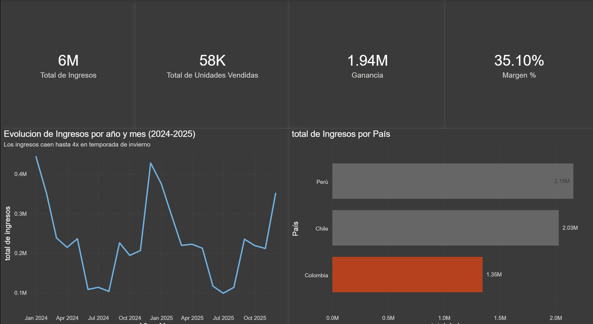
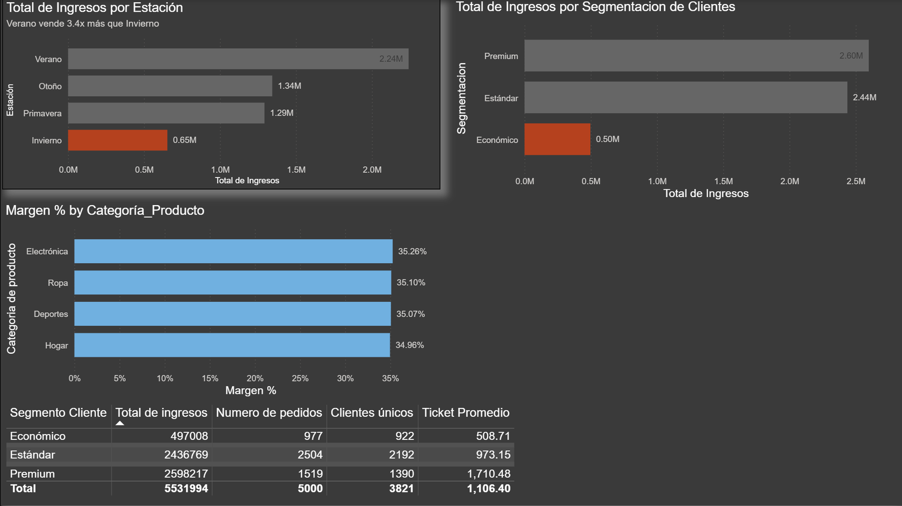

# Commercial Performance Dashboard — Andes Retail Group (Power BI)

Two-view Power BI dashboard analysing 2024–2025 sales for a retailer operating in Peru, Chile and Colombia, built to answer how revenue evolved and what explains its swings.

## Business Question

Andes Retail Group sells across four categories in three countries. Management needed a dashboard that answers two questions without anyone having to run a query:

- **Overview:** how has total revenue evolved between 2024 and 2025?
- **Detail:** why has it moved that way?

Splitting the dashboard by purpose rather than by topic is deliberate. The Overview page answers *what is happening* for executives; the Detail page answers *why* for whoever has to act on it.

## Dataset

Transactional data, one row per order, 2024–2025. 5,000 orders, 3,821 unique customers.

| Column | Notes |
|---|---|
| `ID_Pedido`, `Fecha_Pedido`, `ID_Cliente` | Order and customer identifiers, order date |
| `País`, `Región` | Peru, Chile, Colombia |
| `Categoría_Producto` | Electrónica, Ropa, Deportes, Hogar |
| `Segmento_Cliente` | Premium, Estándar, Económico |
| `Estación` | Southern-hemisphere seasons (Summer = Dec–Feb) |
| `Unidades_Vendidas`, `Precio_Unitario` | Volume and unit price |
| `Ingresos`, `Costo` | Revenue and cost — **no profit column** |

The missing profit column is the first real task of the project, not an oversight: the business questions ask about profitability, so `Ganancia` and `Margen %` have to be built.

## Measures Built (DAX)

| Measure | Definition | Why |
|---|---|---|
| `Ganancia` | `Ingresos − Costo` | Absolute profitability, absent from the source |
| `Margen %` | `DIVIDE(Ganancia, Ingresos)` | Efficiency — comparable across groups of different size. `DIVIDE` handles division by zero without breaking the visual |
| `Numero de pedidos` | `COUNTROWS` | Order volume, independent of ticket size |
| `Clientes únicos` | `DISTINCTCOUNT(ID_Cliente)` | Separates "few customers" from "customers who spend little" |
| `Ticket Promedio` | `Ingresos / Numero de pedidos` | The measure that answers which of those two is happening |

A data preparation step in Power Query fixed date formats, corrected numeric types and added a conditional column `Nivel_Venta` (high/low sale by revenue threshold), used as a filter on the Detail page.

## Headline Numbers

| KPI | Value |
|---|---|
| Total revenue | 5.53M |
| Units sold | 58K |
| Profit | 1.94M |
| Margin | 35.10% |

**By country:** Peru 2.16M · Chile 2.03M · Colombia 1.35M
**By season:** Summer 2.24M · Autumn 1.34M · Spring 1.29M · Winter 0.65M
**By segment:** Premium 2.60M · Estándar 2.44M · Económico 0.50M

## What the Dashboard Shows

### Revenue is seasonal, and the pattern repeats

Revenue is not stable across the period: it drops sharply in winter months (June–August) and spikes in summer (December–January), with up to a **4x gap between the highest and lowest month**.

The seasonal breakdown confirms it is a recurring cycle rather than a one-off: **summer sells 3.4x more than winter**, in both years. That makes it predictable, and predictable means it can be planned for — inventory and staffing can be sized by season instead of absorbed as a surprise twice a year.

### The Económico segment's problem is ticket size, not customer count

Económico generates **19.5% of orders but only 9% of revenue**. The obvious reading is that it is a small segment. The ticket table says otherwise:

| Segment | Revenue | Orders | Unique customers | Average ticket |
|---|---|---|---|---|
| Económico | 497,008 | 977 | 922 | 508.71 |
| Estándar | 2,436,769 | 2,504 | 2,192 | 973.15 |
| Premium | 2,598,217 | 1,519 | 1,390 | 1,710.48 |
| **Total** | **5,531,994** | **5,000** | **3,821** | **1,106.40** |

Económico places almost one order in five. What it does not do is spend: its average ticket of 508.71 is **3.4x lower than Premium's 1,710.48**.

That distinction changes the recommendation entirely. A segment with few customers needs acquisition spend. A segment with many customers and a low ticket needs upsell and bundling — the customers are already there and already buying.

### Margin is flat across categories

Electrónica 35.26% · Ropa 35.10% · Deportes 35.07% · Hogar 34.96%.

A 0.30 percentage point spread between the best and worst category. No category is dragging profitability down, which rules out product mix as an explanation for the revenue swings and points back to seasonality.

## Executive Summary (SCQA)

> **Situation.** Andes Retail Group's revenue is spread across 2024 and 2025 in its three markets.
>
> **Complication.** Revenue is not stable: it falls sharply in winter and spikes in summer, with up to a 4x gap between the highest and lowest month.
>
> **Question.** Is this a recurring pattern or an isolated event?
>
> **Answer.** The seasonal view confirms a recurring cycle — summer sells 3.4x more than winter, in both years. It is predictable, which makes it plannable for inventory and staffing.

**Async message, as sent to stakeholders:**

> **Commercial performance update**
>
> Team — we analysed 2024–2025 sales across Colombia, Peru and Chile.
>
> **Main finding:** revenue drops 3.4x in winter against summer — the same pattern in both years, not an isolated month.
>
> **Recommendation:** size inventory and staffing down for winter, and before the next season validate whether there is a specific cause behind the drop (competitor pricing, delivery times, staffing availability).

## Design Decisions

**Two pages, split by purpose.** KPI cards and trend on the Overview for leadership; breakdowns, the ticket table and filters on the Detail page for analysis. Mixing both on one page produces a dashboard where everything competes for attention and nothing is found quickly.

**Explanatory titles, not descriptive ones.** The trend chart is not titled "Revenue by month" but carries the subtitle *"Los ingresos caen hasta 4x en temporada de invierno"*. A reader who only skims titles still leaves with the finding.

**Colour carries meaning.** Grey for everything, orange reserved for what needs attention — Colombia as the weakest market, winter as the weakest season, Económico as the underperforming segment. When every series has its own colour, colour stops being information and becomes decoration.

**Filters chosen for what they enable.** `Fecha_Pedido` as a date range rather than a year selector, because the finding is seasonal and a year filter cannot show a season. `Nivel_Venta` on the Detail page to split high- and low-value orders without losing either group.

## Files

- [`dashboard-overview.png`](dashboard-overview.png) — Overview page
- [`dashboard-detail.png`](dashboard-detail.png) — Detail page
- `andes_retail_dashboard.pbix` — Power BI file, opens in Power BI Desktop (Windows)

## Tools

- Power BI Desktop — modelling, DAX measures, report canvas
- Power Query — type fixes, date formatting, conditional column

## Author

**Sebastian Ladino Novoa** — Data Analytics Portfolio
